# Desarrollo de la Solución: Sistema de Gestión de Observaciones Clínicas con FHIR

## Descripción General

El sistema desarrollado es una aplicación web que permite gestionar observaciones clínicas (como signos vitales) utilizando el estándar FHIR. Esto garantiza la interoperabilidad de los datos clínicos entre sistemas. La solución incluye un **backend** que gestiona los recursos FHIR y un **frontend** que proporciona una interfaz amigable para visualizar, crear, editar y eliminar observaciones clínicas.

---

## Backend

### 1. Elección de Tecnología

Se optó por **Node.js** con **Express** debido a:

- **Escalabilidad**: Ideal para APIs RESTful con múltiples endpoints.
- **Amplia comunidad**: Gran soporte para estándares como JWT y FHIR.
- **Integración nativa con JSON**: Alineado con el formato de los recursos FHIR.

### 2. Estructura del Proyecto

El backend sigue una arquitectura basada en controladores, servicios y modelos:

- **Controladores**: Manejan las solicitudes HTTP y responden con datos JSON.
- **Servicios**: Implementan la lógica de negocio, como validaciones FHIR.
- **Modelos**: Definen el esquema de la base de datos utilizando **Sequelize** para PostgreSQL.

### 3. Endpoints

Se implementaron los siguientes endpoints:

- **Autenticación**

  - `POST /auth/register`: Crea un nuevo usuario con contraseña cifrada.
  - `POST /auth/login`: Genera un token JWT para el usuario autenticado.

- **Gestión de Pacientes**

  - `GET /patients`: Devuelve la lista de pacientes.
  - `GET /patients/:id`: Devuelve los detalles de un paciente.
  - `POST /patients`: Crea pacientes
  - `PUT /patients/:id`: Edita un paciente
  - `DELETE /patients/:id`: Elimina un paciente

- **Gestión de Observaciones**

  - `GET /patients/:id/observations`: Lista las observaciones clínicas del paciente.
  - `POST /patients/:id/observations`: Crea una nueva observación validando el formato FHIR.
  - `PUT /observations/:id`: Actualiza una observación existente.
  - `DELETE /observations/:id`: Elimina una observación clínica.
  - `GET /observations/:id/fhir`: Muestra una observación en fomato fhir lista para interoperar

Para realizar peticiones a la api se utilizó [REST Client]() la cual permite hacer pruebas dentro la herramienta y los metodos quedan guardados en el proyecto

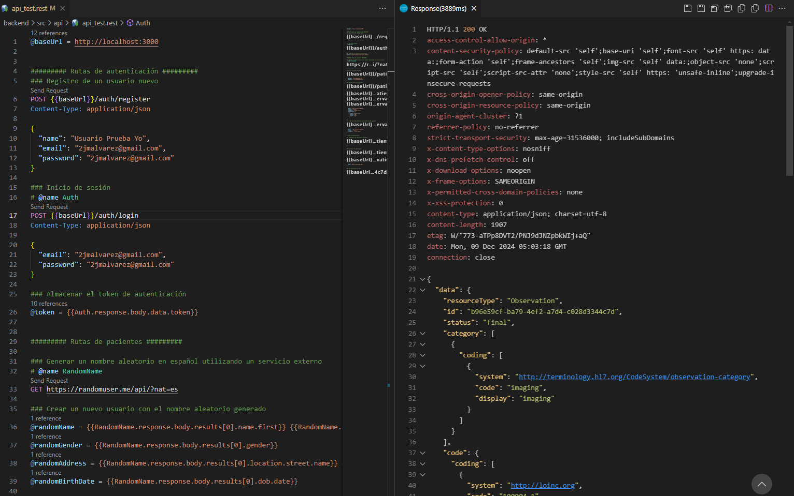

_Se pueden crear pacientes de prueba ejecutando primero "Generar un nombre aleatorio en español utilizando un servicio externo", esto completa la variable que comienzan con random y luego ejecutar "Crear un nuevo paciente"_

### 4. Base de Datos

Se utilizó **PostgreSQL** con los siguientes modelos:

- **Usuario**: ID, nombre, email, contraseña (hash bcrypt)
- **Paciente**: ID, nombre, fecha de nacimiento, género, dirección.
- **Observación**: ID, código, valor, fecha, referencia al paciente (ID), referencia al usuario creador (ID), categoria
- **Componentes**: ID, código, valor, unidad, referencia al observacion (ID),

#### Diagrama Entidad Relación

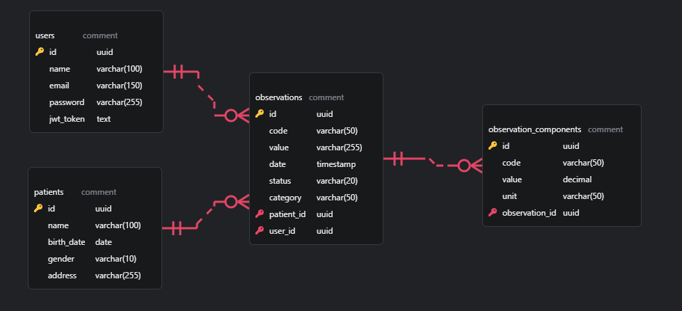

_Este diagrama se realizó con una extension llamada [ERD Editor](https://marketplace.visualstudio.com/items?itemName=dineug.vuerd-vscode), el cual se encuentra dentro del proyecto en la carpeta db. Cabe destacar que tambien exporta el código necesario para crearlo en sql, asi como tambien exporta los tipos de datos de typescripts para poder usar dentro del sistema. El archivo con este DER es backend\src\db\der.fhir.vuerd_

#### Conexión a DB

En el poryecto esta configurada la conexión a la base de datos, por meido de la extension [sql tool](https://marketplace.visualstudio.com/items?itemName=mtxr.sqltools) se puede ejecutar querys desde archivos del proyecto, por ejemplo para consultar o replicar los query que hacen los models

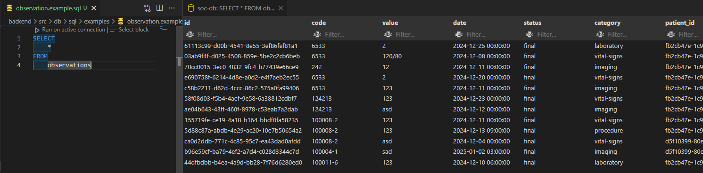

_Ejecutando ddl.fhir.sql se genera el modelo automaticamente en la db ( cuidado que elimina las tablas y las vuelve a crear )._

### 4. Validación FHIR y manejo de errores

- Se implementaron reglas para asegurar que los datos cumplen con el estándar FHIR, como:
  - Se obtuvo la base de datos de loinc en formato csv la cual se utiliza en los esquemas de validación de joi para ver si los códigos ingresados son validos
  - Las categorias de las observaciones se obtienen directamente desde [terminology.hl7.org](https://terminology.hl7.org/6.1.0/CodeSystem-observation-category.json)
  - Se realizan otras pruebas de validacion por medio de los esquemas.
  - El modelo de datos esta protegido con claves foraneas para garantizar consistencia de los datos y concordancia con el estandar FHIR
  - Se uso libreria @smile-cdr/fhirts para verificar la aplicacion del estandar
- Se comprobó por medio del validador https://validator.fhir.org/ que el metodo `GET /observations/:id/fhir` genera un recurso FHIR que cumple con las validaciones del estandar sin errores fatales.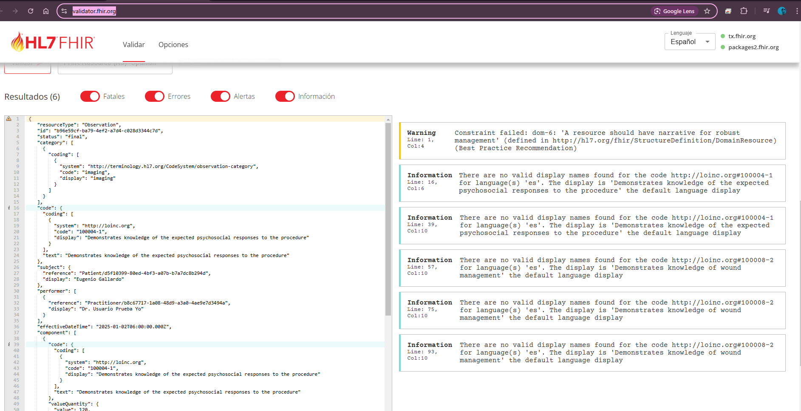
- Para el menejo de errores se crearon clases con los distintos tipos de error y su codigo de estatus correspondiente
  - Los errores se propagan adecuadamente
  - Cuando falla una validacion se muestra en la terminal de la api y se envia al front para informarle al usuario
    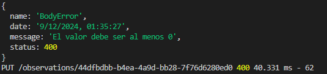
  - Todos los metodos verifican si cumplen con los los esquemas de parametros y body generando los errores segun la configuracion del esquema
  - Se crearon funciones para estandarizar el manejo de rutas garantizando siempre la misma estructura de respuesta exitosa y fallida

### 5. Autenticación y Autorización

- **JWT** se utilizó para autenticar solicitudes.
- Los endpoints protegidos verifican:
  - Si el token es válido.
  - Si el token no está vencido

---

## Frontend

### 1. Elección de Tecnología

Se seleccionó **Next.js** (React) por:

- **Renderizado híbrido**: Soporte para SSR/CSR para optimización de carga.
- **Facilidad de integración**: Excelente compatibilidad con APIs RESTful.

### 2. Funcionalidades

- **Login**: Formulario de autenticación con manejo de errores.
- **Lista de Pacientes**: Muestra pacientes desde el backend.
- **Lista de Observaciones**: Permite explorar las observaciones de un paciente.
- **Formulario de Observaciones**:
  - Creación de nuevas observaciones seleccionando el tipo y valor.
  - Validación de campos obligatorios antes del envío.
- **Edición/Eliminación de Observaciones**: Interfaz para actualizar o borrar datos.

### 3. Validaciones

- Los formularios verifican:
  - Campos obligatorios (nombre, código, valor).
  - Formato válido de fechas y valores (según las reglas FHIR).
- Los mensajes de error claros ayudan al usuario a corregir datos.

### 4. Pantallas

##### **Login**: Formulario de autenticación

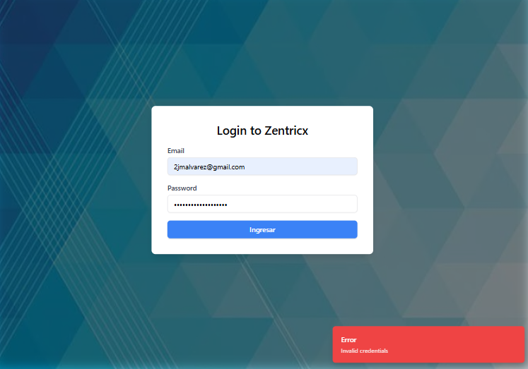

##### Lista de Pacientes: Muestra pacientes desde el backend.

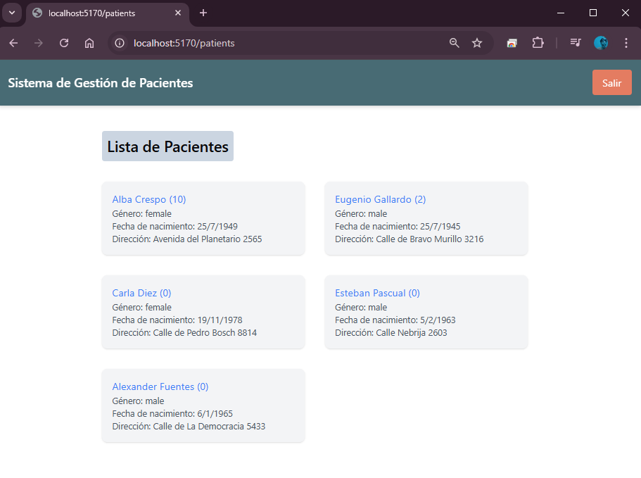

##### **Lista de Observaciones**: Haciendo click en un paciente se ingresa al listado de observaciones

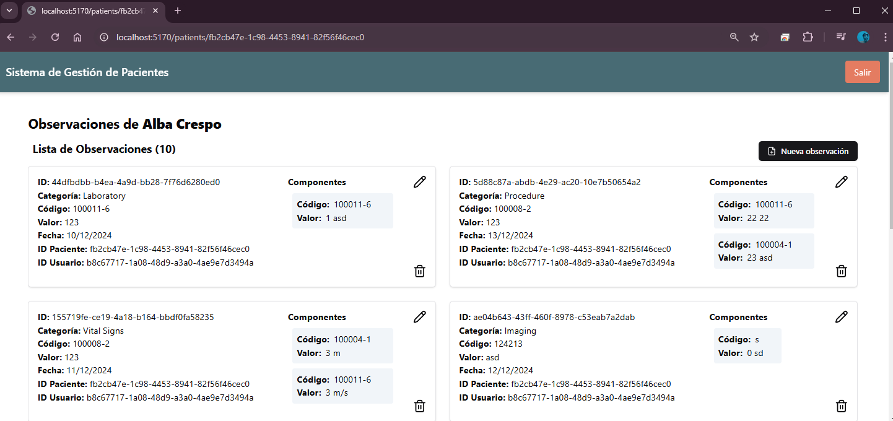

##### **Formulario de Observaciones**

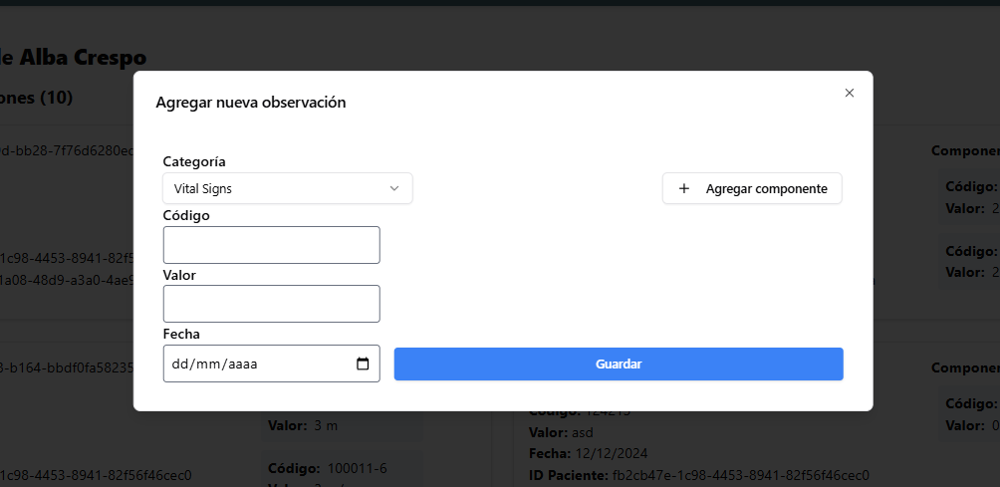

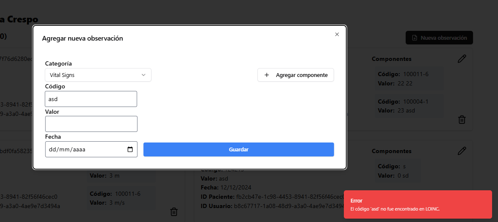

##### Edición: Haciendo click en el lapiz se puede editar la informacion

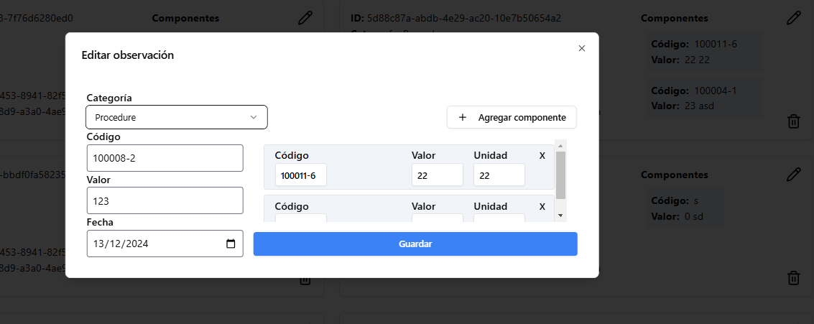

##### Eliminación de Observaciones: Haciendo click en la papelera se puede eliminar la observacion. Los componentes se eliminan en cascada automaticamente

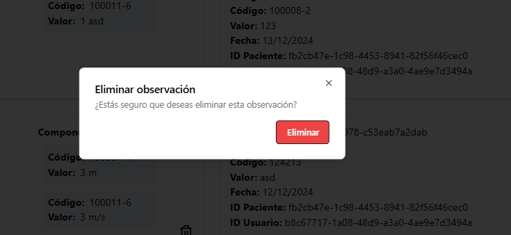

---

## Consideraciones Técnicas

### 1. Manejo de Errores

- **Backend**: Respuestas estandarizadas con códigos HTTP (`400`, `401`, `404`, `500`) y mensajes descriptivos.
- **Frontend**: Notificaciones visuales para errores como credenciales incorrectas o validaciones fallidas.

### 2. Seguridad

- Contraseñas cifradas con **bcrypt**.
- Tokens JWT con tiempos de expiración.
- Sanitización de entradas para prevenir inyecciones SQL/XSS.

### 3. Testing

- Pruebas unitarias en backend con **Jest** para:
  - Validación de recursos FHIR.
  - Manejo de JWT.
  - Lógica CRUD de observaciones.
- Pruebas de integración con **Postman** para los endpoints clave.

---

## Documentación

Aparte de este documento tambien se creó un archivo `README.md` con:

1. **Instrucciones de configuración**:

   - Instalación de dependencias.
   - Configuración de variables de entorno.

2. **Ejecución del proyecto**:

   - Comandos para levantar el backend y frontend.
   - Ejemplo de ejecución con datos de prueba.

---

## Evaluación y Conclusión

### Criterios Cumplidos

- **Funcionalidad completa**: Todos los endpoints y componentes del frontend implementados.
- **Buenas prácticas**: Código modular, uso de control de versiones (Git), y validaciones robustas.
- **Estándar FHIR**: Validación completa de recursos antes de su almacenamiento.
- **Interfaz amigable**: Diseño minimalista pero funcional.

Este sistema es una base sólida que garantiza interoperabilidad y extensibilidad para futuros desarrollos en el ámbito clínico.
